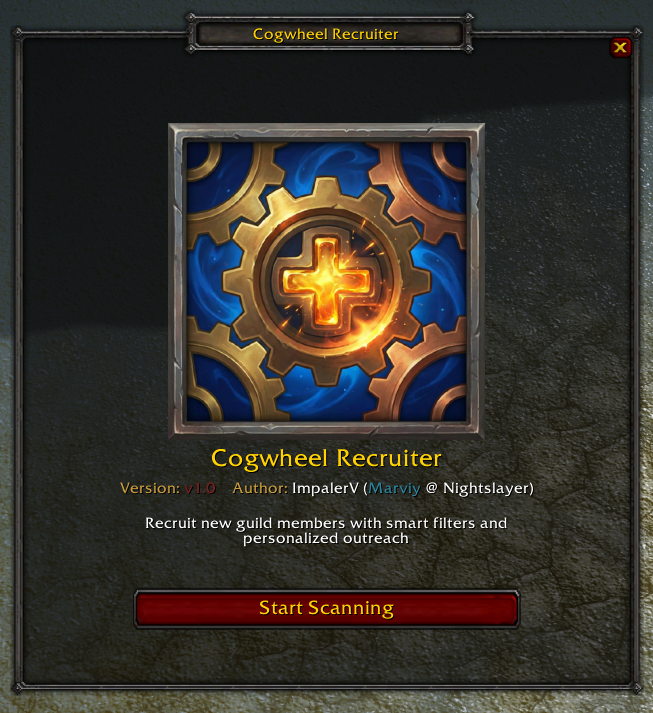
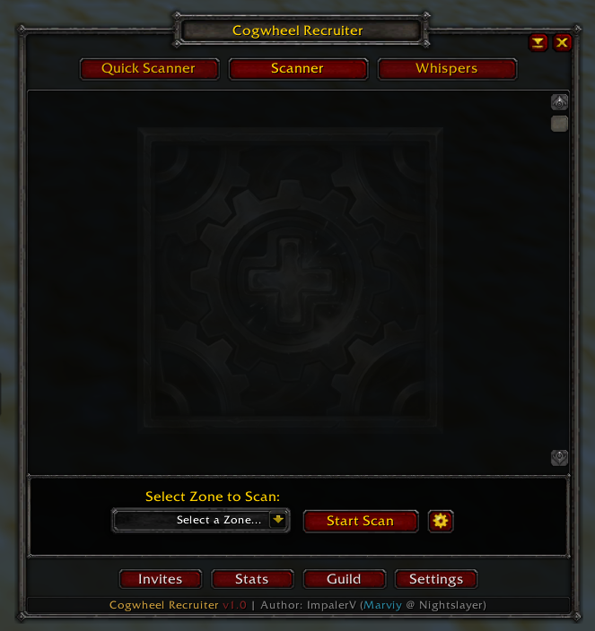
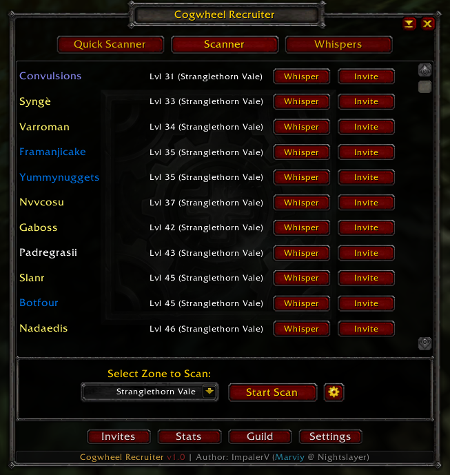
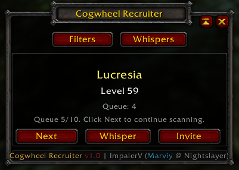
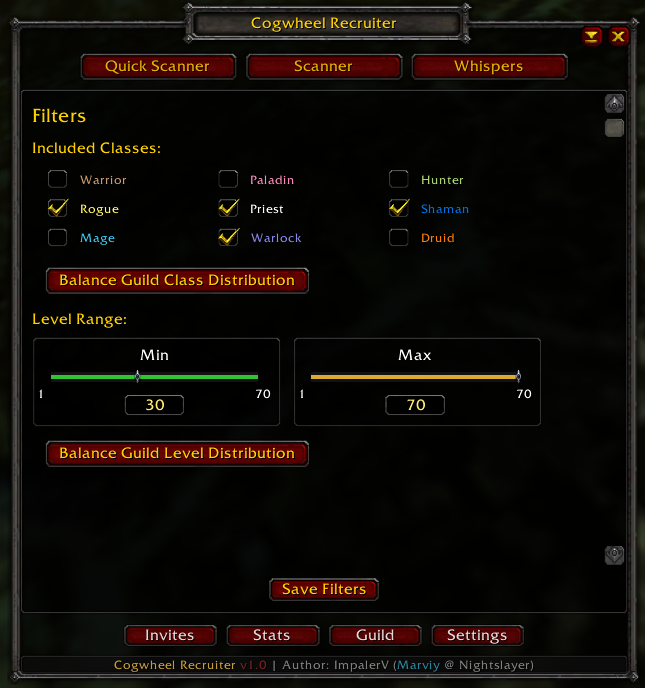
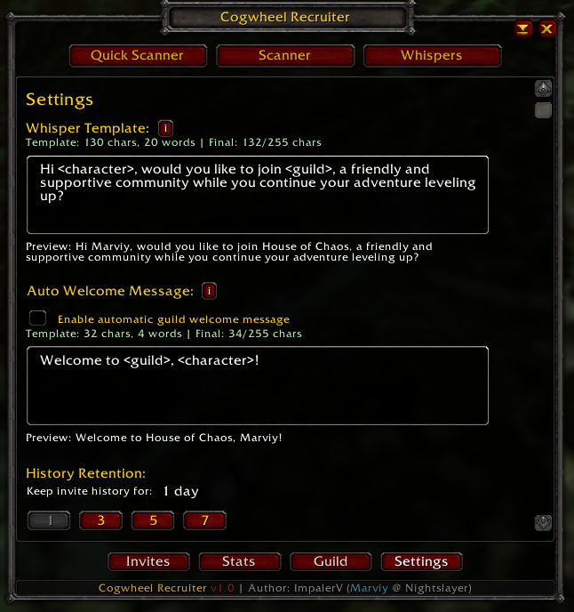

# Cogwheel Recruiter

<p align="center">
  
</p>


Cogwheel Recruiter is a World of Warcraft guild recruitment addon for finding unguilded players, sending personalized outreach, tracking outcomes, and reviewing guild/member distribution data.

## Features

- Scanner mode for zone-based `/who` recruitment targeting.
- Quick Scanner mode for lightweight one-by-one candidate flow.
- Personalized outreach with tokenized templates:
  - `<character>` / `{character}`
  - `<guild>` / `{guild}`
  - `<class>` / `{class}`
- Whispers inbox with invite/clear actions.
- Invites history tab with outcomes (invited, declined, joined).
- Recruitment analytics dashboard (persistent, independent of history retention):
  - whispered
  - whisper answers
  - invites sent
  - accepted
  - per-class/per-level invite and acceptance metrics
  - highest/lowest acceptance buckets
- Guild tab with active-member distribution views and guild chat reporting.
- Configurable minimap button behavior:
  - Left-click: Scanner mode
  - Right-click: Quick Scanner mode

## In-Game Usage

- Slash command: `/cogwheel`
- Minimap button:
  - Left-click opens Scanner
  - Right-click opens Quick Scanner
  - Shift + right-drag moves icon

Main pages:

- `Scanner`: full scan results, invite and whisper actions
- `Quick Scanner`: compact queue-driven recruiting flow
- `Whispers`: incoming replies and follow-up actions
- `Invites`: recent invite outcomes
- `Settings`: templates, auto welcome, retention, and other behavior
- `Filters`: class and level targeting
- `Stats`: recruitment performance metrics
- `Guild`: guild composition and active-member distribution

## Screenshots

### Welcome



### Scanner




### Quick Scanner



### Filters and Settings




## Installation

Copy this addon folder into your WoW AddOns directory:

- `Interface/AddOns/CogwheelRecruiter`

The committed deploy scripts below automate this.

## Development and Deployment

This repository is intended to be the source of truth. Deploy to the WoW AddOns folder after changes.

### Local config (not committed)

Create `deploy.config.json` in repo root by copying `deploy.config.example.json`.

`deploy.config.json` is ignored by git and should contain your local WoW path.

Example:

```json
{
  "wowDir": "D:\\Games\\World of Warcraft\\_anniversary_",
  "addonRelativePath": "Interface\\AddOns\\CogwheelRecruiter",
  "include": [
    "CogwheelRecruiter.lua",
    "CogwheelRecruiter.toc",
    "CogwheelRecruiter_Constants.lua",
    "CogwheelRecruiter_Defaults.lua",
    "CogwheelRecruiter_Utils.lua",
    "CogwheelRecruiter_Analytics.lua",
    "CogwheelRecruiter_Permissions.lua",
    "CogwheelRecruiter_Messaging.lua",
    "CogwheelRecruiter_QuickScanner.lua",
    "CogwheelRecruiter_Scanner.lua",
    "CogwheelRecruiter_ScannerView.lua",
    "CogwheelRecruiter_Minimap.lua",
    "CogwheelRecruiter_FrameShell.lua",
    "CogwheelRecruiter_WindowRouting.lua",
    "CogwheelRecruiter_WhispersFlash.lua",
    "CogwheelRecruiter_WhispersInbox.lua",
    "CogwheelRecruiter_WhispersView.lua",
    "CogwheelRecruiter_TemplatePreview.lua",
    "CogwheelRecruiter_StatsView.lua",
    "CogwheelRecruiter_GuildView.lua",
    "CogwheelRecruiter_SettingsFiltersView.lua",
    "CogwheelRecruiter_HistoryView.lua",
    "CogwheelRecruiter_GuildReports.lua",
    "Media"
  ]
}
```

### PowerShell deploy (Windows)

From repo root:

```powershell
.\scripts\deploy.ps1
```

Optional explicit path override:

```powershell
.\scripts\deploy.ps1 -WowDir "D:\Games\World of Warcraft\_anniversary_"
```

### Bash deploy (WSL)

From repo root in WSL:

```bash
./scripts/deploy.sh
```

Optional explicit path override:

```bash
./scripts/deploy.sh "D:\Games\World of Warcraft\_anniversary_"
```

WSL deploy script notes:

- Requires `python3` for JSON parsing.
- Uses `wslpath` when a Windows path is provided.

## Data Storage

Saved variables:

- `CogwheelRecruiterHistoryDB`
- `CogwheelRecruiterSettingsDB`
- `CogwheelRecruiterWhispersDB`
- `CogwheelRecruiterAnalyticsDB`

History retention pruning affects invite history entries only. Analytics are tracked separately and persist independently.

## Current Dev Note

`FORCE_INVITE_PERMISSION_BYPASS` is disabled by default in `CogwheelRecruiter.lua`. Keep it `false` for normal production behavior.

## Author

ImpalerV (Marviy @ Nightslayer)


